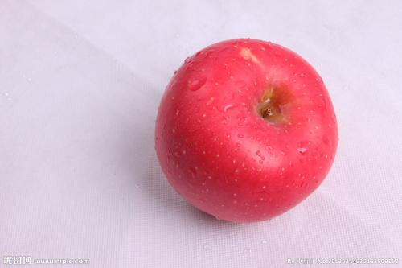
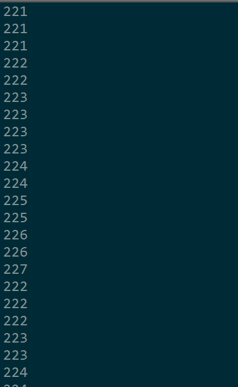
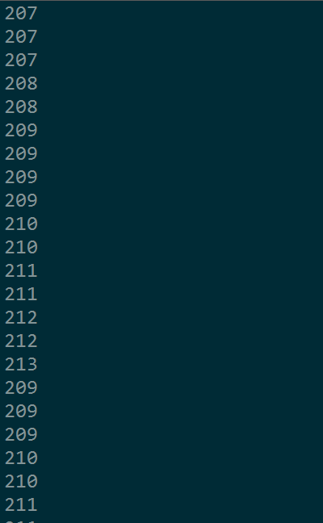
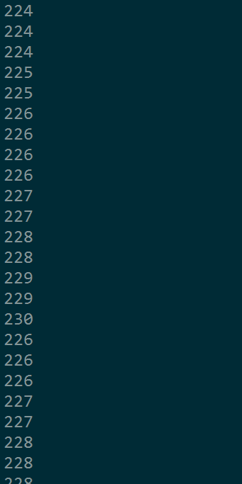

### 图像处理的灰度和二值化

###### 前言

​	在图像处理中，用RGB三个分量（R：Red，G：Green，B：Blue），即红、绿、蓝三原色来表示真彩色，R分量，G分量，B分量的取值范围均为0~255，比如一张图片上的一个红色的像素点的三个分量的值分别为：255，0，0。 

###### 像素点

​	像素点是最小的图像单元，一张图片由好多的像素点构成 。如下图：



查看这张图片的信息：


尺寸是500 * 333 的，宽度是500像素，高度是333像素。也就是说这张图片是由一个500 * 333的像素点矩阵构成的。这个矩阵是333行，500列，像素是图像的最小单元，这张图片的宽度是500个像素点的长度，高度是333个像素点的长度，共有500 * 333 个像素点。 因为一个像素点的颜色是由RGB三个值来表现的，所以一个像素点矩阵对应三个颜色向量矩阵，分别是R矩阵，G矩阵，B矩阵，它们也都是500 *333大小的矩阵。 

颜色矩阵图（这儿全是一个个输出的，实际上是像素点在图片中的对应位置）

- RGB

  

- R

  

- G

  

- B

  

可以看到R、G、B对应的第一个值分别是221、207、224，所以这个像素点的颜色就是（221,207,224）正好对应RGB值的第一个。


###### 图像灰度化

​	在理解了一张图片是由一个像素点矩阵构成之后，我们就知道我们对图像的处理就对这个像素点矩阵的操作，想要改变某个像素点的颜色，我们只要在这个像素点矩阵中找到这个像素点的位置，比如第x行，第y列，所以这个像素点在这个像素点矩阵中的位置就可以表示成（x，y）,因为一个像素点的颜色由红、绿、蓝三个颜色变量表示，所以我们通过给这三个变量赋值，来改变这个像素点的颜色，比如改成红色（255，0，0），可以表示为（x，y，（R=255，G=0，B=0））。

​      那么什么叫图片的灰度化呢？其实很简单，就是让像素点矩阵中的每一个像素点都满足下面的关系：R=G=B，此时的这个值叫做灰度值。

灰度处理的方法，一般灰度处理经常使用两种方法来进行处理：

方法1：

```
灰度化后的R=（处理前的R + 处理前的G +处理前的B）/ 3
灰度化后的G=（处理前的R + 处理前的G +处理前的B）/ 3
灰度化后的B=（处理前的R + 处理前的G +处理前的B）/ 3
```

方法2：

```
灰度化后的R =  处理前的R * 0.3+ 处理前的G * 0.59 +处理前的B * 0.11
灰度化后的G =  处理前的R * 0.3+ 处理前的G * 0.59 +处理前的B * 0.11
灰度化后的B =  处理前的R * 0.3+ 处理前的G * 0.59 +处理前的B * 0.11
```


###### 图像的二值化

​	二值化就是让图像的像素点矩阵中的每个像素点的灰度值为0（黑色）或者255（白色），也就是让整个图像呈现只有黑和白的效果。在灰度化的图像中灰度值的范围为0~255，在二值化后的图像中的灰度值范围是0或者255。

​      黑色：

​               二值化后的R =  0

​               二值化后的G =  0

​               二值化后的B =  0

​      白色：

​               二值化后的R =  255

​               二值化后的G =  255

​               二值化后的B =  255

​       那么一个像素点在灰度化之后的灰度值怎么转化为0或者255呢？比如灰度值为100，那么在二值化后到底是0还是255?这就涉及到取一个阀值的问题。

常用的二值化方法：

方法1：

​          取阀值为127（相当于0~255的中数，（0+255）/2=127），让灰度值小于等于127的变为0（黑色），灰度值大于127的变为255（白色），这样做的好处是计算量小速度快，但是缺点也是很明显的，因为这个阀值在不同的图片中均为127，但是不同的图片，他们的颜色分布差别很大，所以用127做阀值，白菜萝卜一刀切，效果肯定是不好的。

方法2：

​          计算像素点矩阵中的所有像素点的灰度值的平均值avg

​          （像素点1灰度值+...+像素点n灰度值）/ n = 像素点平均值avg

​         然后让每一个像素点与avg一 一比较，小于等于avg的像素点就为0（黑色），大于avg的 像素点为255（白色），这样做比方法1好一些。

​    方法3：

​          使用直方图方法（也叫双峰法）来寻找二值化阀值，直方图是图像的重要特质。直方图方法认为图像由前景和背景组成，在灰度直方图上，前景和背景都形成高峰，在双峰之间的最低谷处就是阀值所在。取到阀值之后再一 一比较就可以了。


