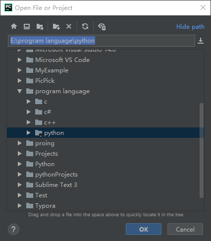

#### Python之虚拟环境

##### 给一个项目创建虚拟环境

###### 方式一（在项目里添加环境）

1. 直接打开一个项目：

   

2. File -> Settings打开如下窗口

   

3. 选择show all，点击“+”号

   

4. 看到如下图所示

   

   ```
   这时应该选择新的环境，因为这个环境是专门针对当前项目的，这是会在你的项目文件夹下自动创建一个空的文件夹venv，这个就是新的环境文件夹，里面可以放各种包。而且该项目也可以选择你所需要的python编译器。
   ```

   

5. 选择OK，这时就创建好了

   

   ###### 

###### 方式二（单独建环境）

1. 打开windows命令终端（cmd）安装虚拟环境 virtualenv

   ```
   pip3 install virtualenv
   ```

   

2. 创建虚拟环境

   ```
   virtualenv venv
   ```

   

3. 激活环境

   ```
   cd venv\Scripts
   activate.bat
   ```

   

4. 在该环境下安装该项目需要的包

   ```
   pip3 install packagename
   ```

   


