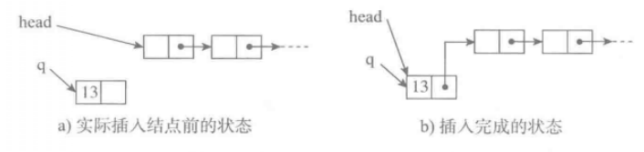
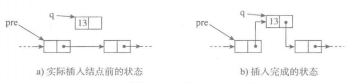

# 线性表


## 1 - 表的抽象数据类型

```reStructuredText
ADT List:                    # 表抽象数据类型
    List(self)               # 表构造操作，创建一个新表
    is_empty(self)           # 判断self是否为空表
    len(self)                # 获得self的长度
    prepend(self,elem)       # 将元素elem加入表中作为第一个元素
    append(self,elem)        # 将元素elem加入表中作为最后一个元素
    insert(self,elem,i)      #将elem加入表中作为第i个元素，其他元素的顺序不变
    del_first(self)          # 删除表中首元素
    del_last(self)           # 删除表中尾元素
    del(self,i)              # 删除表中第i个元素
    search(self,elem)        # 查找元素elem在表中出现的位置，不出现返回-1
    forall(self,op)          # 对表中的每个元素执行操作op
```


## 2 - 实现方式

- 顺序表
- 链表

### 2.1 顺序表实现

​	基本实现方式：表中元素顺序放在一片足够大的连续存储空间，首元素（第一个元素）存入存储区的开始位置，其余元素一次存放。元素之间的逻辑关系通过元素在存储区里的物理位置表示。

#### 2.1.1 基本实现方式

- 表中元素类型相同

  1. 这样存储每个表元素所需的存储量相同，可以在表里等距安排同样大小的存储位置。

  2. 假设有一个顺序表对象，其元素存储在一片元素存储区，该存储区的起始位置（内存地址）已知为l~0~。假设元素编号从0开始，元素e~0~的位置为Loc(e~0~)=l~0~，如果表中一个元素所需的存储单元数为c=size，则e~i~的地址计算公式：

     ​						Loc(e~i~)=Loc(e~0~)+cxi

  3. 图示：

     

- 表中元素类型不同

  1. 将实际数据另行存储，在顺序表里各单元位置保存对相应元素的应用信息。由于每个引用所需的存储量相同，可以通过上面的公式计算出引用的存储位置，就能得到实际元素的数据了。

  2. 图示：

     

  

#### 2.1.2 相关操作实现

​	建立可变的顺序表。在一个顺序表的元素存储区中，一般情况是保存着一些元素，还存在一些可以存放元素的空位。在这种情况下需要约定元素的存放方式，通常把已有元素连续存放在存储区的前一段，空位留在后面。为了保证正确的操作，需要记录元素存储区的大小和当前的元素个数。


```Python
#顺序表类
class seq_list(object):
    #顺序表的最大容量、元素个个数、存放数据的数组
    def __init__(self, max = 10):
        self.max = max
        self.num = 0
        self.data = [None] * self.max
        #self.data = [''] * self.max

    #输出线性表中的数据
    def __str__(self):
        return " ".join((str(self.max), str(self.num), str(self.data)))

    #判断空
    def is_empty(self):
        return self.num is 0

    #判断是否满了
    def is_full(self):
        return self.num is self.max

    #获取线性表的长度，既元素 个数
    def count(self):
        return self.num


    #在线性表的末尾增加一个元素
    def append(self, element):
        #先判断表是否满了
        if self.num == self.max:
            print("表已经满了！操作失败！")
            return
        else:
            self.data[self.num] = element
            self.num += 1

    #在线性表下表为loc的位置添加元素，而不是插在第几个
    def insert(self, loc, value):
        #判断表是否满了
        if self.is_full():
            print('表已经满了！')
            return
        elif loc < 0:
            raise IndexError('下标错误')
        else:
           for i in range(self.num, loc, -1):
               self.data[i] = self.data[i-1]
           self.data[loc] = value
           self.num += 1

    #查找
    #查找所有值为value的元素并返回下标，把下标放在列表里
    def search(self, value):
        for i in range(0, self.num):
            if self.data[i] == value:
                yield i
    #查找第一个元素值为value的值的下标并返回
    def search(self, value):
        for i in range(0, self.num):
            if self.data[i] == value:
                return i


    #删除
    #删除下表为loc的元素
    def delete_l(self, loc):
        if loc < 0 or loc > self.num - 1:
            raise IndexError
        else:
            for i in range(loc, self.num):
                self.data[i] = self.data[i+1]
            self.num -= 1

    #删除所有值为value的元素
    def delete_v(self, value):
        j = 0 #记录删除的个数
        #先看值是否存在
        for i in range(self.num):
            if self.data[i] == value:
                self.delete_l(i)
                j += 1
        if j == 0:
            return '不存在该'

    # 顺序表反转
    def reverse(self):
        # 扫描指针，分别放在首尾
        i, j = 0, self.num - 1
        while i < j:
            self.data[i], self.data[j] = self.data[j], self.data[i]
            i, j = i + 1, j - 1


seq = seq_list()
# print(seq)
# print(seq.is_empty())
# print(seq.is_full())
for i in range(5):     #加入元素
    seq.append(i)
# 在c语言的顺序表中一个表中 只能放类型相同的元素，在这可以放各种不同的元素
# seq.append([x * x for x in range(3)])
# seq.append('felix')
# print(seq.count())     #统计个数

# 插入元素
seq.insert(2, 4)

for j in range(seq.num):  #输出目前的元素
    print(seq.data[j])

print('-' * 10)

seq.reverse()
for j in range(seq.num):  #输出目前的元素
    print(seq.data[j])
# print(seq.count())
# seq.delete_l(2)
# for j in range(seq.num):
#     print(seq.data[j])
# print(seq.count())
# print(type(seq.data[2]))
# print(seq.search('two'))
# print(list(seq.search(4)))


```

#### 2.1.3 顺序表及其操作的性质

​	定位加入和删除操作的时间复杂度。

假设给定的顺序表里有n个元素，在其中下表为i的位置加入一项新数据，需要移动n-i个元素；删除下表为i的数据项需要移动n-i-1个元素。再假设在位置i加入和删除元素的概率分别为p~i~和p~i~^‘^，则加入操作中平均元素移动次数是：∑~i=0~^n^ (n-i)*p~i~，删除操作的平均移动次数是

∑~i=0~^n-1^ (n-i-1)*p~i~^‘^ 。这两个操作的平均时间复杂度是O(n)。最坏情况也是O(n)。

#### 2.1.4 顺序表小结

- 优点：随机存取元素（O(1)时间完成）；元素在表里存储紧凑，除表元素存储区之外只需要O(1)空间存放少量辅助信息。
- 缺点：需要连续的存储区存放表中元素，如果表很大，就需要很大片的连续内存空间；一旦确实了存储块的大小，可容纳元素个数并不随着插入/删除操作的进行而变化；如果很大的存储区只存了少量的数据项，就会有大量空闲单元，造成内存浪费；在执行加入或删除操作时，通常需要移动许多元素，效率低；建立表时需要考虑元素存储区的大小，可是实际中很难事先估计。

#### 2.1.5 顺序表的结构

##### 2.1.5.1 两种基本实现方式

- 一体式结构

  

  ​	存储表信息的单元与元素存储区以连续的方式安排在一块存储区里，几部分数据的整体形成一个完整的表对象。这种实现方式比较紧凑，有关信息几种在一起，整体性强，易于管理。缺点是创建后元素存储区就固定了。

- 分离式结构

  

  ​	表对象里只保存与整个表有关的信息（容量和元素个数），实际元素存放在另一个独立的元素存储区，通过链接与基本表对象关联。这样表对象的大小统一，但不同表对象可以关联不同大小的元素存储区。

##### 2.1.5.2 替换元素存储区

​	分离式结构的优点是，标识不变的情况下，为表对象换一块元素存储区。也就是说，表还是原来的表，内容没变，只是容量变了。如果用一体式结构实现顺序表，那么当表里面的元素满了以后，如果再插入数据就会出错，这时，分离式结构就派上用场了。这时可以在不改变对象的情况下换一块更大的存储区，过程：

- 另外申请一块更大的元素存储区；
- 把表中已有元素复制到新的存储区；
- 用新的元素存储区替换原来的元素存储区；
- 实际加入新元素。

##### 2.1.5.3 后端插入和存储区扩充

​	当不确定表中的元素数量时，可用动态存储技术。这样，每当表满时就换一块存储区，虽然在后端插入元素的时间复杂度是O(1)，但是，当需要换更大的存储区时，要复制表中的元素，整个复制需要O(m)时间（m是当时的元素个数）。可能的解决方法是，每次换元素存储区时增加n个空位，这样，复制次数大约是1/20xn^2^ 。如果每次增加这时一次插入操作的平均代价是O(n)。如果每次容量加倍，元素复制的次数是O(n)，这时插入操作的平均时间复杂度是O(1)。**Python标准类型的list就利用了这种分离式存储技术。**


### 2.2 链接表

​	实现线性表的另一种方式就是链接结构。基本思想：

- 把表中元素分别存储在一批独立的存储快里。
- 保证从组成表结构中的任一结点可找到与其相关的下一结点。
- 在前一结点里用链接的方式显示地记录与下一结点之间的关联。

#### 2.2.1 单链表

1. 概念：单向链接表（单链表）的结点是一个二元组，其表元素域elem保存着作为表元素的数据项，链接域next里保存着同一个表里的下一个结点的标识。

   

2. 特点：

   - 从引用表中首结点的变量（p）可以找到这个表的首结点；
   - 从表中任意一结点可以找到下一个结点，这样，从p就能找到表中所有结点。

3. 小结：

   - 为了掌握一个表，只要用一个变量保存着这个表的首结点的引用。这个变量称为**表头变量或表头指针**；
   - 一个单链表由一些具体的表结点构成；
   - **每个结点是一个对象，有自己的标识，称其为该结点的链接**；
   - 结点之间通过结点链接建立起单向的顺序联系。
   - **表的结束**：给表的最后结点的链接域设置一个不会作为结点对象标识的值，用Python中用**None**表示。

4. 表结点类

   ```Python
   class LNode(object):
   
       def __init__(self, elem, next_=None):
           self.elem = elem
           self.next = next_
   
   # 创建一个结点
   llist1 = LNode(1)
   # p指向这个结点
   p = llist1
   
   # 在结点后添加数据项elem为2,3...10的结点
   for i in range(2, 11):
       # p指向结点llist1，p.next为结点llist1的next域
       p.next = LNode(i)
       # 让p指向当前表的最后一个结点
       p = p.next
   # 再让p回到第一个结点
   p = llist1
   # 如果p的下一个不为空
   while p is not None:
       print(p.elem)
       # p往后移动一个结点位置
       p = p.next
   
   '''
   1
   2
   3
   4
   5
   6
   7
   8
   9
   10
   '''
   ```

5. 单链表类的定义和相关操作

   基于结点类LNode定义一个单链表对象的类，在这个表对象里只有一个引用链接结点的_head域，初始化为None表示建立的是空表。

   - 相关操作

     - 创建空链表

       把表头变量_head设为None

       ```Python
       head = None
       ```

       

     - 删除链表

       丢弃这个链表里的所有结点，把表头变量_head设为None

       ```Python
       head = None
       ```

       

     - 判断链表是否为空

       将表头变量与空链接比较，即检查表头指针是否是None

       ```Python
       return head is None
       ```

       

     - 判断表是否满了

       一般链表是不会满的，除非计算机内存被用完了

     - 插入元素

       头插法、尾插法、定位插入。向单链表中插入元素是不需要移动元素的，只需要将相应的结点链接在链表的相应的位置即可，通过修改链接实现。

       - **头插法** - 向表中插入一个元素作为表的第一个元素。

         1. 创建一个结点，数据域存放需要插入的数据；

         2. 把原来的头结点的指针域（链接域）存入新结点的指针域；

         3. 把头指针指向新添加的结点

         4. 图示：

            

         5. 代码：

            ```Python
            q = LNode(elem)
            q.next = head.next
            head = q
            ```

            

       - **定位插入** - 要想在单链表的一个位置插入新的结点，那么必须知道该位置之前的那个结点。假如已经找到要插入结点的前一个结点的索引pre：

         1. 创建一个结点存入数据；

         2. pre所指结点的链接域的值存入新的结点的链接域，这样就将原来pre所指结点的后面的所有结点链接到新结点后面了；

         3. 修改pre的链接域next的值，值其指向新结点。

         4. 图示：

            

         5. 代码：

            ```Python
            q = LNode(elem)
            q.next = pre.next
            pre.next = q
            ```

       - **尾插法**

         在链表的最后插入元素，必须先找到链表的最后一个结点。

         ```Python
         def append(self, elem):
             # 如果是空链表
             if self._head is None:
                 self._head = LNode(elem)
                 return
             p = self._head  # 循环指针
             while p.next is not None:
                 p = p.next
             p.next = LNode(elem)
             
         ```

         

     - 删除元素

       - 删除表首元素

         只需修改头指针，让其指向第二个结点。被丢弃的结点将被Python解释器自动回收。

         ```python
         head = head.next
         ```

       - 一般情况的元素删除

         1. 找到将被删除的结点的前一个结点，假设该结点已经找到且指针是pre；

         2. 修改pre的next域，使其指向被删除结点的下一个结点。

         3. 代码：

            ```python
            pre.next = pre.next.next
            ```

         4. 图示：

            

     - 扫描链表

       单链表是一个方向的链接，开始只知道表头指针，所以对链表的扫面只能从表头开始。

       **基本模式**：

       ```Python
       p = head  # 扫描指针
       while p is not None and 条件:
           操作p所指结点里的数据
           p = p.next
       ```

       注：其中循环使用的是循环变量p，称为扫面指针。每个扫描循环必须使用一个扫面指针作为控制变量，每步迭代要检查值是否是None。

       **按下标定位**：

       链表首结点的元素应看作下标0，其他元素依次排列。确定第i个元素所在结点的操作称为按下标定位，模式：

       ```Python
       p = head
       while p is not None and i > 0:
           i -= 1
           p = p.next
       ```

       循环结束的两种情况：

       1. 扫描完表中所有的结点还没有找到第i个结点；
       2. 找到了，即p停下的位置。

       比如现在要删除第k个结点，可以先将i设置为k-1，循环后检查i是0且p.next不是None就可以执行删除了。

       **按元素定位**

       加入需要在链表里找到满足条件pred的元素，可以按如下模式：

       ```Python
       p = head
       while p is not None and not pred(p.elem):
           p = p.next
       ```

       循环结束的情况：

       1. p是None；
       2. pred(p.elem)是True。

       如：找到第一个满足条件pred的元素

       ```Python
       def find(self, pred):
           p = self._head
           while p is not None:
               if pred(p.elem):
                   return p.elem
               p=p.next
       ```

     - 求表的长度

       ```Python
       def length(head):
           p, n = head, 0
           while p is not None:
               n += 1
               p = p.next
           return 0    
       ```

       这个函数采用扫描模式，遍历表中所有结点完成计数。

     - 表的遍历

       线性表一类的对象称为汇集对象，它们本身是对象，其中又包含着一组元素对象。实际使用时，我们可能会操作表中的每个元素，如输入所有元素，这种操作需要我们**遍历**整个表，传统的遍历方式是为汇集对象类定义一个遍历函数，它以一个操作为参数，将其作用到对象的每个元素上。如：

       ```Python
       def for_each(self, func):
           p = self._head
           while p is not None:
               func(p.elem)
               p = p.next
       ```

       使用示例：

       ```Python
       obj.for_each(print)  # 打印出所有元素
       ```

       但是这样并不是很灵活，可以使用lambda来解决这个问题。

       - **生成器**

       还可以使用**生成器**来取得所有元素

       ```Python
       def elements(self):
           p = self._head
           while p is not None:
               yield p.elem
               p = p.next
       ```

       这样，遍历输出链表中的所有元素就可以这样写：

       ```Python
       for x in obj.elements():
           print(s)
       ```

     - **筛选生成器**

       可以看出，前面的find方法只能获取满足条件的第一个元素，但是往往满足条件的不仅仅是一个元素，可能有很多。下面做出修改：

       ```Python
           def filter(self, condition):
               p = self._head
               while p is not None:
                   if condition(p.elem):
                       yield p.elem
                   p = p.next
       ```

   - **代码**：

     ```Python
     '''单链表类'''
     
     # 操作的错误类
     class LinkedListUnderflow(ValueError):
         pass
     
     # 结点类
     class LNode(object):
     
         def __init__(self, elem, next_=None):
             self.elem = elem
             self.next = next_
     
     # 单链表类
     class LList(object):
     
         def __init__(self):
             self._head = None
     
         # 判断是否为空
         def is_empty(self):
             return self._head is None
     
         # 求表的长度
         def length(self):
             p, n = self._head, 0
             while p is not  None:
                 n += 1
                 p = p.next
             return n
     
         # 打印出表的所有元素
         ## 方式一
         def show_all(self):
             # p是循环指针
             p = self._head
             # 如果是空表
             if p is None:
                 raise LinkedListUnderflow('该表是空表')
             while p is not None:
                 print(p.elem, end='')
                 if p.next is not None:
                     print(',', end='')
                 p = p.next
             print('')
     
         ## 方式二
         def elements(self):
             p = self._head
             while p is not None:
                 yield p.elem
                 p = p.next
     
         def showall(self):
             for x in self.elements():
                 print(x, end=',')
             print()
     
         '''插入'''
         # 头插法
         def prepend(self, elem):
             # 分两步：
             # 1.LNode(elem, self._head) - 该结点的链接域先指向self._head指向的结点；
             # 2.self._head指向新加的这个结点
             self._head = LNode(elem, self._head)
     
         # 尾插法
         def append(self, elem):
             if self._head is None:
                 self._head = LNode(elem)
                 return
             p = self._head
             while p.next is not None:
                 p = p.next
             p.next = LNode(elem)
     
         # 任意位置插入
         # 将数值value插入到第i个元素后面
         def insert_i(self, value, i):
             lnode = LNode(value)
             p, n = self._head, i-1
             while p is not None and n > 0:
                 p = p.next
                 n -= 1
             lnode.next = p.next
             p.next = lnode
     
         # 将value插入到第一个值为value1的结点的后面
         def insert_value(self, value, value1):
             if self._head is None:
                 raise LinkedListUnderflow('该表是空表')
             p = self._head
             while p is not None:
                 if p.elem == value1:
                     lnode = LNode(value)
                     lnode.next = p.next
                     p.next = lnode
                     return
                 p = p.next
             return '不存在该值，操作失败'
     
     
         '''删除'''
         # 删除表头结点，并返回该结点的数据域中的值
         def pop(self):
             # 无结点情况
             if self._head is None:
                 raise LinkedListUnderflow("表中无结点")
             # 有结点
             value = self._head.elem
             self._head = self._head.next
     
         # 删除表尾结点
         def deltail(self):
             # 如果是空链表
             if self._head == None:
                 raise LinkedListUnderflow('该表是空表，非法操作')
             #如果链表只有一个结点，那就是删除头结点
             p = self._head
             if p.next == None:
                 e = p.elem
                 self._head = None
                 return e
             else:
                 # 检查当前p指向的下一个结点的下一个结点是否是最后一个结点
                 while p.next.next is not None:
                     p = p.next
                 # 如果p.next.next是None，说明p.next所指的结点就是最后一个结点
                 e = p.next.elem
                 p.next = None
                 return e
     
         # 删除任意位置结点
         # 删除表中第k个结点
         def delete_k(self, k):
             if k < 0 or k == 0: 
                 raise LinkedListUnderflow('请输入大于0的数字！')
             elif k == 1:
                 self.pop()
             else:
                 p, n = self._head, k-1
                 # n>1是为了找到第k个结点的前一个结点
                 while p is not None and n > 1:
                     p = p.next
                     n -= 1
                 p.next = p.next.next
     
         # 删除链表
         def delete(self):
             self._head = None
     
         '''修改'''
     
     
         '''查找'''
         # 找到满足条件condition的元素
         def filter(self, condition):
             p = self._head
             while p is not None:
                 if condition(p.elem):
                     yield p.elem
                 p = p.next
     
         '''遍历'''
         # 操作链表的每个元素，把函数作为参数传入函数
         def for_each(self, func):
             p = self._head
             while p is not None:
                 func(p.elem)
                 p = p.next
     
         # 反转
         def rev(self):
             p = None
             while self._head is not None:
                 q = self._head  # 摘下原来的首结点
                 self._head = q.next  # 把首结点向后移动一个结点  
                 q.next = p
                 p = q  # 将刚摘下的结点加入p引用的结点序列
             self._head = p  # 反转后的结点序列已经做好，重置表头链接
         
     
     
         def test1(self, value):
             print(value * 2, end=',')
     
         def test2(self, value):
             if value == 4:
                 return True
             else:
                 return False
     
     
     
     
     
     if __name__ == '__main__':
         # 建立一个空的单链表
         a_List = LList()
     
         # 把1~13不断地接到单链表上
         for i in range(6):
             a_List.prepend(i)
     
         # 求表的长度
         print(a_List.length())
     
     
         # 打印出单链表a_List的元素
         print(a_List.for_each(a_List.test1))
     
         # 把'felix'插入到第三个位置
         a_List.insert_i(123, 3)
     
         # 打印出单链表a_List的元素
         # a_List.show_all()
         a_List.showall()
     
         # 反转
         a_List.rev()
         a_List.showall()
     
         # 删除第1个结点
         a_List.delete_k(1)
     
         # 打印出单链表a_List的元素
         a_List.show_all()
     
         # 删除最后一个结点
         # a_List.deltail()
     
         # 删除知道只剩一个结点
         for i in range(a_List.length()-1):
             print(a_List.deltail(), end=',')
     
         # 打印出单链表a_List的元素
         a_List.show_all()
     
         # 在表的尾部插入4
         a_List.append(4)
         a_List.show_all()
     
         # 把3查到4前面
         a_List.insert_value(3, 4)
     
         a_List.show_all()
     
         # 筛选生成器(用生成器对象.__next__()  或  next(生成器对象))来输出生成器中的元素
         print(a_List.filter(a_List.test2).__next__())
         print(a_List.filter(a_List.test2).__next__())
     
         # 删除头结点
         # a_List.pop()
         # print('-' * 10)
     
         # 删除链表
         # a_List.delete()
     
         # 判断表是否是空表
         print(a_List.is_empty())
     
     ```

6. 相关操作的时间复杂度

   | 操作         | 时间复杂度                           |
   | ------------ | ------------------------------------ |
   | 创建空表     | O(1)                                 |
   | 删除表       | O(1)（Python解释器做存储也需要时间） |
   | 判断空表     | O(1)                                 |
   | 头插法       | O(1)                                 |
   | 尾插法       | O(n)，因为要找到表的最后结点         |
   | 定位加入元素 | O(n)，平均情况和最坏情况             |
   | 首端删除元素 | O(1)                                 |
   | 尾端删除元素 | O(n)                                 |
   | 定位删除元素 | O(n)                                 |
   | 遍历         | O(n)                                 |

### 2.3 链表的简单变形

#### 2.3.1 带有尾结点引用的单链表

​	前面的单链表有个缺点，就是如果要在尾端插入一个结点，就必须从头开始，已知找到最后一个结点，这样的话，如果经常需要这种操作就是很麻烦的，现在我们直接给尾结点增加一引用。这样只需要常量时间就可以完成尾端的插入操作。


#### 2.3.2 定义该链表类（继承）

- 初始化

  ```Python
  class LList1(LList):
      
      def __init__(self):
          LList.__init__(self)
          self._rear = None  # 比之前的单链表多一个尾结点的引用
  ```

- 头插法

  操作和之前的链表一样，但是多了一个尾结点的引用后，要考虑尾结点的引用域的设置，还有就是当原表是空表的时候，新加入的第一个结点也是最后一个结点。下面我们重载前面的prepend函数。

  ```Python
  # 头插法
      def prepend(self, elem):
          if self._head is None:  # 如果是空表
              # LNode(elem, self._head) - 先让新结点的引用域指向原来头指针指向的地方
              # 再让头指针指向新的结点
              self._head = LNode(elem, self._head)
              # 头指针和尾结点的指针都指向新的结点
              self._rear = self._head
          # 不是空表
          else:
              self._head = LNode(elem, self._head)
  ```

- 尾插法

  增加了尾结点的引用后可以直接找到尾结点，这样就可以很快完成在尾部插入结点的操作。

  ```Python
  # 尾插法
      def append(self, elem):
          # 如果是空表
          if self._head is None:
              self._head = LNode(elem, self._head)
              self._rear = self._head
          else:
              # 先让尾结点的引用域指向新增加的结点
              # 再让尾结点指针指向新的结点
              self._rear.next = LNode(elem)
              self._rear = self._rear.next
  ```

- 弹出表头元素

  这个操作与之前的LList的操作一样，因为都是用_head判断空表。只是当表中只有一个结点时要将尾结点的引用设为空。

  ```Python
  # 弹出第一个元素
      def pop(self):
          # 如果是空表
          if self._head is None:
              raise LinkedListUnderflow('该表中没有元素')
          # 不是空表
          # 如果只有一个元素，则头指针和尾指针都指向None
          elif self._head.next == None:
              self._head = self._head.next
              self._rear = self._head
          # 不只一个元素，丢弃第一个结点
          else:
              self._head = self._head.next
  ```

- 弹出表尾元素

  由于是对最后一个元素的操作，那么一定会对尾指针进行操作的。

  ```Python
  def deltail(self):
          # 如果是空表
          if self._head is None:
              raise LinkedListUnderflow('该表中没有元素')
          # 扫描指针
          p = self._head
          # 表中只有一个元素
          if self._head.next is None:
              e = p.elem
              self._head = None
              return e
          # 找到最后一个结点
          while p.next.next is not None:
              p = p.next
          e = p.next.elem
          p.next = None
          self._rear = p
          return e
  ```


#### 2.3.2 循环单链表

实现：在链表对象里记录表尾结点，这样同时支持O(1)时间的表头/表尾插入和O(1)时间的表头删除。


这种表对象只需一个指针域_rear，它在逻辑上始终引用着尾结点。

##### 2.3.2.1 循环单链表类

```python
from LList import LNode, LinkedListUnderflow

'''循环单链表'''
class LCList(object):

    def __init__(self):
        # 只有一个尾结点指针
        self._rear = None

    # 判断是否是空表
    def is_empty(self):
        return self._rear is None

    # 求表的长度
    def length(self):
        # p - 循环指针，从头开始，n - 计数
        p, n = self._rear.next, 0
        while True:
            if p.next is self._rear.next:
                break
            else:
                n += 1
                p = p.next
        return n + 1

    # 头插法
    def prepend(self, elem):
        # 把要插入的数据放入一个结点
        p = LNode(elem)
        # 如果是空表，建立循环
        if self._rear is None:
            p.next = p
            self._rear = p
        else:
            p.next = self._rear.next
            self._rear.next = p

    # 尾插法
    def append(self, elem):
        # 由于循环的单链表头尾没有明确的概念，所以先在前面插入一个
        self.prepend(elem)
        # 再将尾结点指向刚才新插入的那个结点
        self._rear = self._rear.next

    # 前端弹出
    def pop(self):
        # 如果是空表
        if self._rear is None:
            raise LinkedListUnderflow('空表')
        # p保存要弹出的结点
        p = self._rear.next
        # 如果只有一个结点
        if self._rear is p:
            self._rear = None
        else:
            self._rear.next = p.next
        # 返回要删除的元素
        return p.elem

    # 尾端弹出
    def deltail(self):
        # 如果是空表
        if self._rear is None:
            raise LinkedListUnderflow('空表')
        # 扫面指针，从头开始
        p = self._rear.next
        if self._rear is p:
            self._rear = None
        else:
            while p.next.next is not self._rear.next:
                p = p.next
            # return p.next.elem
            p.next = self._rear.next
            self._rear = p


    # 输出所有元素
    def showall(self):
        if self.is_empty():
            return
        # 循环指针，先放在开头
        p = self._rear.next
        while True:
            # 注意这儿是先打印再判断p到哪了
            print(p.elem)
            # 如果p移动到了结尾
            if p is self._rear:
                break
            p = p.next

if __name__ == '__main__':
    lclist = LCList()

    # 头插
    for i in range(1, 4):
        lclist.prepend(i)

    # 尾插
    for i in range(4, 7):
        lclist.append(i)

    # 从头删除
    lclist.pop()

    # 尾部删除
    lclist.deltail()

    # 输出所有
    lclist.showall()

    print(lclist.length())

```

#### 2.3.3 双链表

​	如果希望两端加入和删除操作都能高效完成，就必须修改设计，加入另一方向的链接，这样就得到了双向连接表，即双链表。为了支持首尾两端的高效操作，双链表如下所示，包含一个尾结点引用域。这样，从双链表任一结点出发，就可以直接找到其后的相邻结点。设：结点的下一结点引用域是next，前一结点引用域是prev。


##### 2.3.3.1 结点删除


```Python
p.prev.next = p.next
p.next.prev = p.prev
```

##### 2.3.3.2 双链表结点类

这儿多了一个反向引用域，这里在LNode类的基础上派生。

```Python
class DLNode(LNode):
    def __init__(self, elem, prev=None, next_=None):
        LNode.__init__(self, elem, next_)
        self.prev = prev
```

##### 2.3.3.3 双链表类

该类从带首尾结点引用的单链表类LList1派生。


该链表中的方法如判断空表和find、filter、打印所有都可以继承，因为它们只是用next方向的引用。如果方法要操作prev的，则需要重新定义该方法。

```Python
'''双链表'''
from LList import LNode, LinkedListUnderflow
from LList1 import LList1

# 双链表结点类
class DLNode(LNode):
    def __init__(self, elem, prev=None, next_=None):
        LNode.__init__(self, elem, next_)
        self.prev = prev

class DLList(LList1):

    def __init__(self):
        LList1.__init__(self)

    # 头插法
    def prepend(self, elem):
        # 先设置next域，指向head指向的结点
        p = DLNode(elem, None, self._head)
        # 如果是空表
        if self._head is None:
            self._rear = p
        # 不是空表
        else:
            # 再设置之前第一个结点的prev域的值，指向新加入的这个结点
            p.next.prev = p
        self._head = p

    # 尾插法
    def append(self, elem):
        # 先设置prev指针域，让prev指向之前的最后一个结点
        p = DLNode(elem, self._rear, None)
        if self._head is None:
            self._head = p
        else:
            # 在设置以前最后一个结点的next域，让其指向新的结点
            p.prev.next = p
        self._rear = p

    # 删除第一个结点
    def pop(self):
        # 如果是空表
        if self._head is None:
            raise LinkedListUnderflow('空表')
        # 保存被删除的元素
        e = self._head.elem
        # 让链表的头指针指向第二个结点
        self._head = self._head.next
        if self._head is not None:
            # 把第二个结点的prev指针设为空
            self._head.prev = None
        return e

    # 删除尾结点
    def deltail(self):
        if self._head is None:
            raise LinkedListUnderflow('空表')
        e = self._rear.elem
        # 让表尾指针指向倒数第二个结点
        self._rear = self._rear.prev
        # 如果删除了一个结点后，没有结点了
        if self._rear is None:
            self._head = None
        else:
            # 把倒数第二个结点的next设为None
            self._rear.next = None
        return e


if __name__ == '__main__':

    # 创建双链表对象
    dllist = DLList()

    # 头插法
    for i in range(1, 4):
        dllist.prepend(i)

    # 尾插法
    for i in range(4, 7):
        dllist.append(i)

    # 删除第一个结点
    dllist.pop()

    # 输出所有
    dllist.for_each(print)


```

#### 2.3.4 循环双链表

​	让表尾结点的next域指向表的首结点，而让表首结点的prev域指向尾结点。


**类的实现**

```Python
'''循环双链表'''

from DLList import DLNode
from LList import LList

class LCDList(LList):

    def __init__(self):
        LList.__init__(self)


    # 表的长度
    def length(self):
        # 如果是空表
        if self._head is None:
            return 0
        else:
            # 初始化cursor指向头结点，且count这时取1
            cursor = self._head
            count = 1
            # 如果cur.next不是head，说明cur目前不是最后一个元素，那么count就1，再让cur后移一位
            while cursor.next is not self._head:
                count += 1
                cursor = cursor.next
            return count

    # 头插法
    def prepend(self, elem):
        node = DLNode(elem)
        # 如果是空表
        if self._head is None:
            self._head = node
            # 头尾都指向自己
            node.next = node
            node.prev = node    
        # 不为空      
        else:
            # 先设置结点的前后指针域
            node.next = self._head  # p的next设为现在的head指向的结点
            node.prev = self._head.prev  # p的prev为head的prev
            # 再设置原来的头尾结点的prev和next指针域
            self._head.prev.next = node # 原来的尾结点的next为新结点p
            self._head.prev = node  # 原来的头结点的prev为新结点p
            # 更改头指针指向p
            self._head = node

    # 尾插法
    def append(self, elem):
        # 如果是空表，就可以用头插法
        if self._head is None:
            self.prepend(elem)
        else:
            node = DLNode(elem)
            # 先设置新结点的prev和next指针
            node.next = self._head # 原来的头结点
            node.prev = self._head.prev  # 原来的尾结点
            self._head.prev.next = node  # 原来尾结点的next指向新结点
            self._head.prev = node  # 头指针指向尾结点，即新增加的结点

    # 在位置pos插入结点
    def insert(self, pos, item):
        # 如果插入位置<0，采用头插法
        if pos < 0:
            self.prepend(item)
        # 如果位置是最后一个元素或者更大
        elif pos > self.length() - 1:
            self.append(item)
        # 如果插入位置在链表中间
        else:
            index = 0  # 计数，记录向后移动了多少部
            cursor = self._head  # cursor记录当前位置
            #让index每次自增1 ，cur后移，当index=pos-1的时候说明cur在要插入位置的前一个元素，这时候停下
            while index < pos - 1:
                index += 1
                cur = cur.next
            #跳出循环，cur在要插入位置的前一个元素，将node插入到cur的后面
            node = DLNode(item)  # 新建一个节点
            node.next = cursor.next  # node的后继设为cur的后继
            node.prev = cursor  # node的前驱设为cur
            cursor.next.prev = node  # cur后继的前驱改为node
            cursor.next = node  # cur后继改为node

    # 删除元素
    def remove(self, item):
        # 如果是空表，不操作
        if self.is_empty():
            return
        # 不为空
        else:
            # 扫描指针，从头开始
            cursor = self._head
            # 如果头结点就是要删除的结点
            if cursor.elem == item:
                # 如果只有一个结点，链表就空了
                if self.length() == 1:
                    self._head = None
                # 如果有多个元素
                else:
                    self._head = cursor.next  # 头指针指向cursor的下一个元素
                    cursor.next.prev = cursor.prev  # cursor后继的前驱改为cursor的前驱
                    cursor.prev.next = cursor.next  # cursor前驱的后继改为cursor的后继
            # 头结点不是要删除的结点
            else:
                cursor = cursor.next
                while cursor is not self._head:
                    # 如果找到了要删除的结点
                    if cursor.elem == item:
                        cursor.prev.next = cursor.next  # cursor的前驱的后继改为cursor的后继
                        cursor.next.prev = cursor.prev  # cursor的后继的前驱改为cursor的前驱
                    cursor = cursor.next

    #搜索节点是否存在
    def search(self, item):
    #如果链表是空的一定不存在
        if self.is_empty():
            return False
        #否则链表不空
        else:
            cursor = self.__head #设置临时cur从头开始
            # cursor不断后移，一直到尾节点为止
            while cur.next is not self.__head:
                #如果期间找到了就返回一个True 结束运行
                if cur.item == item:
                    return True
                cur = cur.next
            # 从循环跳出来cursor就指向了尾元素 看一下为元素是不是要找的 是就返回True
            if cur.item ==item:
                return True
        #所有元素都不是 就返回False 没找到
        return False

    
    '''遍历'''
    # 操作链表的每个元素，把函数作为参数传入函数
    def for_each(self, func):
        # 如果为空
        if self._head is None:
            return
        # 循环指针，初始化为链表的头部
        cursor = self._head
        while cursor.next is not self._head:
            func(cursor.elem)
            cursor = cursor.next
         # 跳出循环时，cursor走到了最后一个结点，于是cursor.next=self._head
         # 导致最后一个结点没有得到打印，则跳出循环后把它打印出来
        print(cursor.elem)

```

### 2.4 链表的相关操作

#### 2.4.1 链表排序

**插入排序**

**基本思想**：

- 该排序的序列分为两个部分：已排序的和未排序的。初始时已排序段只包含一个元素，可以是任意元素，一个元素的序列我们总认为是有序的；
- 每次从未排序的元素中取出一个元素，将其插入已排序片段中的正确位置，保持插入后的序列片段任然是正确排序；
- 当所有元素都加入了排序的片段时，排序完成。

**图示**：


​	由于未排序的部分越来越小，已排序的部分越来越大，因此可以让这个两个片段共用原来的表，可以将已经排序的放前面，未排序的放后面。

**顺序表的排序过程**：

​	如图，下表i之前的部分已经排好，从i开始的部分没有排序，下面考虑位置i上的元素d的插入问题。这样，每处理完一个元素后，i向右移动一位，直至i的值超出表的右端时排序完成。

​	循环开始时取出d，使位置i变为空位。状态如图，新下标变量j记录空位，并逐步左移。每次迭代将j-1位置的元素域d比较，如果d小，就把位于j-1位置的元素移动到j位置，并将j值减一（表示空位左移）。最后将d放入空位。


排序实验：

```
lst = [3, 5, 2, 7, 8, 1]

第一次：
已排序：[3,]
未排序：[5, 2, 7, 8, 1]
x = 5
j = 1
lst[j-1]=lst[0]=3<x
lst[1] = 5

第二次：
已排序：[3, 5,]
未排序：[2, 7, 8, 1]
x = lst[2] = 2
j = 2
lst[j-1] = lst[1] = 5>x
lst[2] = lst[1] = 5
j = j-1=1
lst[1] = x = 2

lst[j-1]=lst[0]=3>2
lst[1]=lst[0]=3
j=0
lst[0]=x=2

第三次：
已排序：[2, 3, 5,]
未排序：[7, 8, 1]
。。。。。。。。。。。
```

**代码**：

```Python
import random

from seq_list import seq_list

class sort(object):

    def for_seq(self, seq):
        for i in range(1, seq.num):
            x = seq.data[i]
            j = i
            while j > 0 and seq.data[j-1] > x:
                seq.data[j] = seq.data[j-1]
                j -= 1
            seq.data[j] = x

if __name__ == '__main__':

    # 创建顺序表对象
    seq1 = seq_list()
    # 创建排序对象
    sort_temp = sort()

    # 向顺序表中插入数据
    for i in range(seq1.max):
        seq1.append(random.randint(1, 50))

    # 输出数据
    seq1.showall()

    # 排序后输出
    sort_temp.for_seq(seq1)
    seq1.showall()


```

**单链表的排序过程**

​	单链表只有next链接，扫描指针只能向下一个方向移动，不能从后向前查找结点。这里有两种可能完成排序的做法：移动元素，调整结点之间的链接关系。

- **移动元素**

  ​	排序的状态如下图，其中扫描指针crt指向当前考虑的结点（假设这里的表元素为x），在一个大循环中每次处理一个表元素并前进一步。对一个元素的处理分两步完成：第一步从头开始扫过小于或等于x的表元素，直至确定了图中已排序段里标出虚线的位置，找到了第一个大于x的表元素；第二步是做一系列“倒换”，把x放入正确位置，并将其他表元素后移。

  

  代码：

  ```Python
  import random
  
  from seq_list import seq_list
  from LList import LList
  
  class sort(object):
  
      # 顺序表的排序
      def for_seq(self, seq):
          for i in range(1, seq.num):
              x = seq.data[i]
              j = i
              while j > 0 and seq.data[j-1] > x:
                  seq.data[j] = seq.data[j-1]
                  j -= 1
              seq.data[j] = x
  
      # 单链表排序
      # 调整元素
      def for_llist(self, llist):
          if llist._head is None:
              return
          crt = llist._head.next  # 从首结点之后的位置开始处理
          while crt is not None:
              x = crt.elem
              p = llist._head
              while p is not crt and p.elem <= x:  # 跳过小元素
                  p = p.next
              while p is not crt:  # 倒换大元素，完成元素的插入工作
                  y = p.elem
                  p.elem = x
                  x = y
                  p = p.next
              crt.elem = x
              crt = crt.next
  
  
  if __name__ == '__main__':
  
      # 创建顺序表对象
      seq1 = seq_list()
      # 创建单链表对象
      llist = LList()
      # 创建排序对象
      sort_temp = sort()
  
      # 向顺序表中插入数据
      for i in range(seq1.max):
          seq1.append(random.randint(1, 50))
  
      # 向单链表中插入数据
      for i in range(10):
          llist.append(random.randint(1, 100))
  
      # 输出顺序表数据
      # seq1.showall()
  
      # 输出单链表数据
      llist.show_all()
  
      # 排序后输出顺序表
      # sort_temp.for_seq(seq1)
      # seq1.showall()
  
      # 排序后输出单链表数据
      sort_temp.for_llist(llist)
      llist.show_all()
  
  
  ```

- **调整链表结点**

  过程：

  如果被处理的表为空或只包含一个元素，它自然是排序的，排序完成。表更长时。函数里用rem记录除第一个元素之外的结点段，然后通过循环把这些点逐一插入_head关联的排序段。函数的内层循环在排序段查找rem结点的插入位置。这里用了两个扫描指针p和q，他们亦步亦趋地前进，知道p所指结点的元素更大或者已到排序结尾，这时结点rem应该插入q和p之间。随后的条件语句分别处理表头插入和一般情况插入，最后；连接好排序段并将rem推进一步。大循环结束时全部结点插入排序段，排序完成。

  代码：

  ```Python
  import random
  
  from seq_list import seq_list
  from LList import LList
  
  class sort(object):
  
      # 顺序表的排序
      def for_seq(self, seq):
          for i in range(1, seq.num):
              x = seq.data[i]
              j = i
              while j > 0 and seq.data[j-1] > x:
                  seq.data[j] = seq.data[j-1]
                  j -= 1
              seq.data[j] = x
  
      # 单链表排序 - 调成元素
      def for_llist(self, llist):
          if llist._head is None:
              return
          crt = llist._head.next  # 从首结点之后的位置开始处理
          while crt is not None:
              x = crt.elem
              p = llist._head
              while p is not crt and p.elem <= x:  # 跳过小元素
                  p = p.next
              while p is not crt:  # 倒换大元素，完成元素的插入工作
                  y = p.elem
                  p.elem = x
                  x = y
                  p = p.next
              crt.elem = x
              crt = crt.next
  
      # 单链表排序 - 调整结点
      def for_list1(self, llist):
          p = llist._head
          if p is None or p.next is None:
              return
  
          rem = p.next
          p.next = None
          while rem is not None:
              p = llist._head
              q = None
              while p is not None and p.elem <= rem.elem:
                  q = p
                  p = p.next
              if q is None:
                  llist._head = rem
              else:
                  q.next = rem
              q = rem
              rem = rem.next
              q.next = p
  
  
  if __name__ == '__main__':
  
      # 创建顺序表对象
      seq1 = seq_list()
      # 创建单链表对象
      llist = LList()
      # 创建排序对象
      sort_temp = sort()
  
      # 向顺序表中插入数据
      for i in range(seq1.max):
          seq1.append(random.randint(1, 50))
  
      # 向单链表中插入数据
      for i in range(10):
          llist.append(random.randint(1, 100))
  
      # 输出顺序表数据
      # seq1.showall()
  
      # 输出单链表数据
      llist.show_all()
  
      # 排序后输出顺序表
      # sort_temp.for_seq(seq1)
      # seq1.showall()
  
      # 排序后输出单链表数据
      sort_temp.for_list1(llist)
     llist.show_all()
  
  
  ```

## 3 - 表的应用

**Josephus问题**

问题描述：假设有n个人围坐一圈，现在要求从第k个人开始报数，报到第m个数的人退出。然后从下一个人继续开始报数并按照同样规则退出，直至所有人退出。要求按顺序输出各出列人的编号。

- **Python数组思想解决**

  解决步骤：

  - 初始：
    - 建立一个包含n个人（的编号）的表。
    - 找到第k个人，从那里开始。
  - 处理过程中采用把相应表元素修改为0的方式表示已出列，反复做：
    - 数m个人（还没出列），遇到表尾就转回下标0继续。
    - 把表示第m个人的表元素修改为0.
  - n个人出列则结束。

  代码实现：

  ```Python
  class Josephus(object):
  
      def __init__(self, value1, value2, value3):
          self.n = value1
          self.k = value2
          self.m = value3
  
      # 数组实现
      def josephus_A(self):
          # 创建n个人的列表
          people = list(range(1, self.n + 1))
  
          # 找到第k个人，i表示数组下标
          i = self.k - 1
          # 因为游戏的最终结局是所有的人都退出，所以循环n此
          for num in range(self.n):
              # 计数
              count = 0
              while count < self.m:
                  # 如果该报数的人的那个位置还有人，即没有退出的话
                  if people[i] > 0:
                      count += 1
                  # 报到m的人退出
                  if count == self.m:
                      print(people[i], end="")
                      # 这个人退出了则该位置的值设为0
                      people[i] = 0
                  # 下一轮从下一个人开始报数
                  i = (i + 1) % self.n
              # 如果还有人没退出，打一个逗号留着输出下一个退出的人
              if num < self.n - 1:
                  print(", ", end="")
              else:
                  print("")
          return
  
  
  
  if __name__ == '__main__':
      j1 = Josephus(50, 7, 4)
      j1.josephus_A()
  ```

- **顺序表解决**

  解决思想：

  ​	 保存人员的编号的list按表的方式处理，一旦确定了应该退出的人，就将表示其编号的表元素从表中删除。

  ​	这样，随着计算的进行，所用的表将越来越短。下面用num表示表的长度，每退出一人，表的长度num减一，至表长度为0时计算工作结束。采用这种思想，表中的元素全是有效元素（不再出现表示没人的0），元素计数与下标计数得到统一，所以下标更新可以用i=(i+m-1)%m统一描述。

  代码：

  ```Python
  # 顺序表的解
      def josephus_L(self):
          people = list(range(1, self.n+1))
  
          num, i = self.n, self.k-1
          for num in range(self.n, 0, -1):
              i = (i+self.m-1) % num
              print(people.pop(i),
                  end=(", " if num > 1 else "\n"))
          return
  ```

- **循环单链表解决**

  循环单链表可以很直观地表示坐一圈的人，顺序数人头可以很自然地反映为在循环表中沿着next链扫描，一个人退出可以用删除相应结点的操作模拟。这样以后可以沿着原方向继续数人头。

  算法描述：

  - 建立包含指定个数（和内容）的结点的循环单链表，这件事可以通过从空表出发，在尾部逐个加入元素的方式完成。
  - 循环计数，找到并删除应该退出的结点。

  代码：

  ```Python
  class Josephus1(LCList):
      def turn(self, m):
          for i in range(m):
              self._rear = self._rear.next
  
      def __init__(self, n, k, m):
          LCList.__init__(self)
          for i in range(n):
              self.append(i+1)
          self.turn(k-1)
          while not self.is_empty():
              self.turn(m-1)
              print(self.pop(),
                  end=("\n" if self.is_empty() else ", "))
  ```

  这个类里定义了新方法turn，它将循环表对象的rear指针沿next方向移m部（相当于结点环旋转）。这个类的初始化函数首先调用基类LCList的初始化函数建立一个空表，然后通过一个循环建立包含n个结点和相应数据的初始循环表。最后的循环反复调用turn方法，找到并逐个弹出结点，输出结点里保存编号。

**该问题的算法实例**

```Python
from LCList import LCList

class Josephus(object):

    def __init__(self, value1, value2, value3):
        self.n = value1
        self.k = value2
        self.m = value3

    # 数组思想实现
    def josephus_A(self):
        # 创建n个人的列表
        people = list(range(1, self.n + 1))

        # 找到第k个人，i表示数组下标
        i = self.k - 1
        # 因为游戏的最终结局是所有的人都退出，所以循环n此
        for num in range(self.n):
            # 计数
            count = 0
            while count < self.m:
                # 如果该报数的人的那个位置还有人，即没有退出的话
                if people[i] > 0:
                    count += 1
                # 报到m的人退出
                if count == self.m:
                    print(people[i], end="")
                    # 这个人退出了则该位置的值设为0
                    people[i] = 0
                # 下一轮从下一个人开始报数
                i = (i + 1) % self.n
            # 如果还有人没退出，打一个逗号留着输出下一个退出的人
            if num < self.n - 1:
                print(", ", end="")
            else:
                print("")
        return

    # 顺序表的解
    def josephus_L(self):
        people = list(range(1, self.n+1))

        num, i = self.n, self.k-1
        for num in range(self.n, 0, -1):
            i = (i+self.m-1) % num
            print(people.pop(i),
                end=(", " if num > 1 else "\n"))
        return

# 循环单链表解决
class Josephus1(LCList):
    def turn(self, m):
        for i in range(m):
            self._rear = self._rear.next

    def __init__(self, n, k, m):
        LCList.__init__(self)
        for i in range(n):
            self.append(i+1)
        self.turn(k-1)
        while not self.is_empty():
            self.turn(m-1)
            print(self.pop(),
                end=("\n" if self.is_empty() else ", "))


if __name__ == '__main__':
    j1 = Josephus(50, 7, 4)
    j2 = Josephus1(50, 7, 4)
    j1.josephus_A()
    j1.josephus_L()

```


